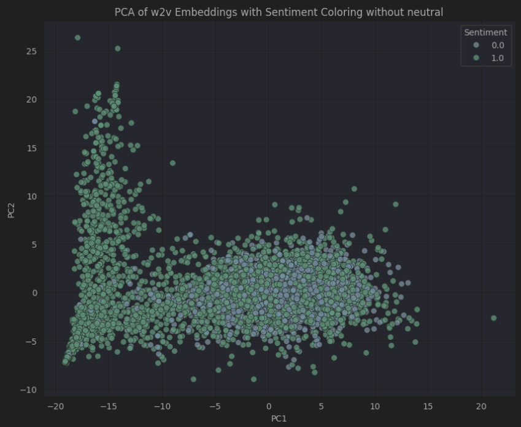

# Описание проекта
## Название проекта: emotion-detector
### Цель: Определить эмоциональную тональность высказываний пользователя.
### Авторы: Большим Максим Антонович P4240

В данной работе решены следующие задачи:
1. Анализ существующих решений в предметной области;
2. Сбор и анализ данных, необходимых для проведения эксперимента;
3. Обучение и, при необходимости, дообучение выбранных моделей;
4. Оценка эффективности моделей на основе вычисленных на исходном наборе данных метрик 
`Precision`, `Recall`, `Accuracy` и `F1`;
5. Выбор наилучшей модели на основе метрик;
6. Развёртывание оптимальной модели на бою.

Был выбран датасет: [Youtube Statistics](https://www.kaggle.com/datasets/advaypatil/youtube-statistics)  

### Описание набора данных:
Датасет "Youtube Statistics" включает два файла, содержащих информацию о видео 
и соответствующих им комментариях. В рамках решаемой задачи особый интерес представляет 
файл с комментариями, который включает 17995 записей, каждая из которых ассоциирована 
с эмоциональной окраской (0, 1, 2):
1. Значение 0 соответствует отрицательному настроению 
2. Значение 1 соответствует нейтральному настроению
3. Значение 2 соответствует положительному настроению

### Обоснование использования данного набора данных:
Данный датасет позволяет понять взаимосвязь между комментариями и их эмоциональностью.
Данная задача эффективно решается сетями, основанных на трансформерах. Данный датасет
может быть дополненным другими датасетами эмоциональных окрасов текстов. В данном случае
этот датасет прекрасно подходит для начальных данных для обучения и тестирования моделей.

Отображение комментариев в пространстве говорит о том, что можно найти разделяющую 
гиперплоскость, что позволит эффективно определять настроение комментария.

